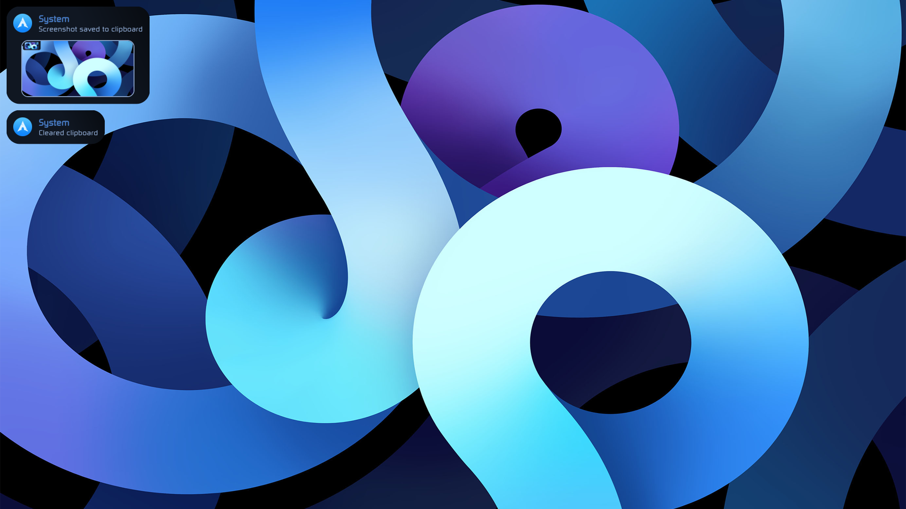

# Ignis based workspace

This is working in progress and very unstable

## V1 milestone
 

- [x] Notification  
- [ ] Bluetooth UI  
- [x] Audio control  
- [ ] WiFi UI  
- [ ] VPN UI  
- [ ] Powermenu  
- [x] Popup for audio and display brightness  
- [x] Taskbar/Tray  

## Dependencies
 

- hellwal (color generator)
