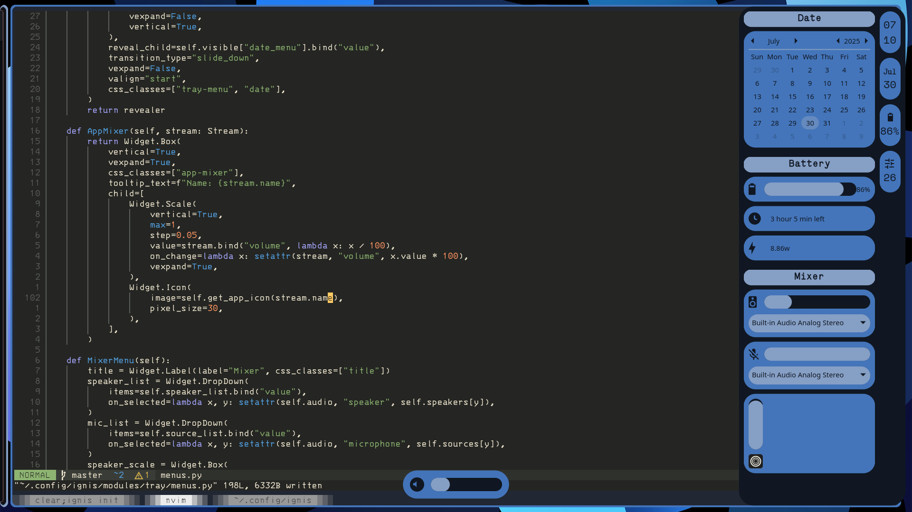

# Ignis based workspace

This is still in work at progress and very unstable

## Features
 

- [ ] Notification  
- [ ] Bluetooth UI  
- [ ] Audio control  
- [ ] WiFi UI  
- [ ] VPN UI  
- [ ] Powermenu  
- [x] Popup for audio and display brightness  
- [x] Taskbar/Tray  

## Dependencies
 

- hellwal (color generator)
