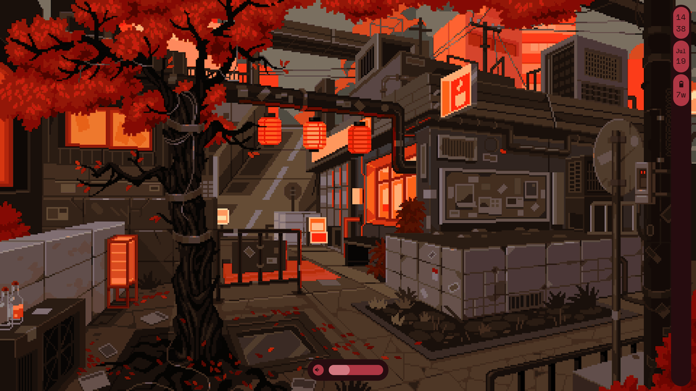

# Ignis based workspace

This is still in work at progress

## Features
 

- [ ] Notification  
- [ ] Bluetooth UI  
- [ ] Individual apps audio control  
- [ ] WiFi UI  
- [ ] VPN UI  
- [ ] Powermenu  
- [x] Popup for audio and display brightness  
- [x] Taskbar/Tray  
