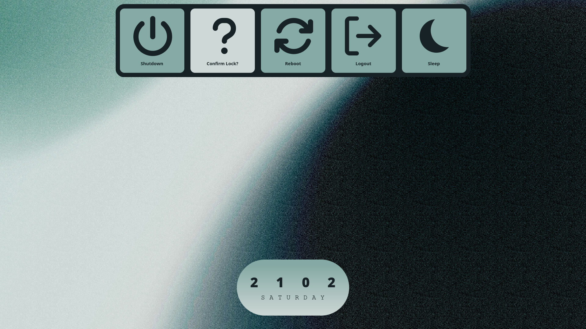
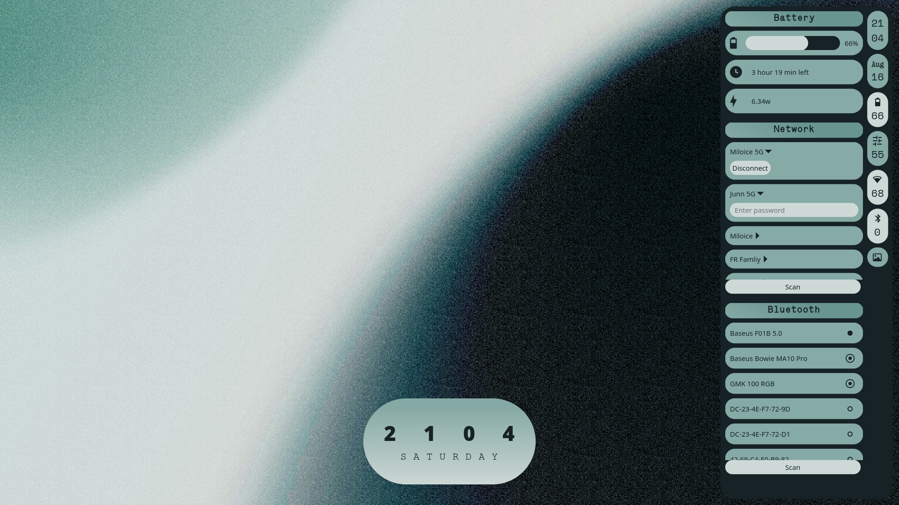
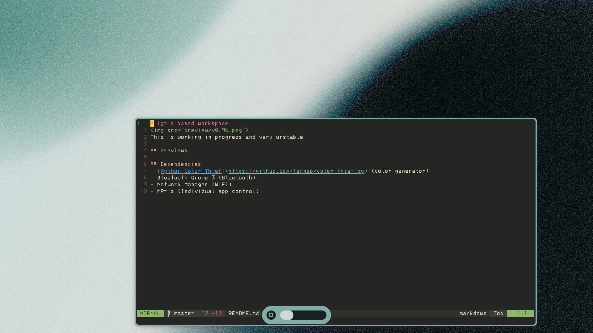
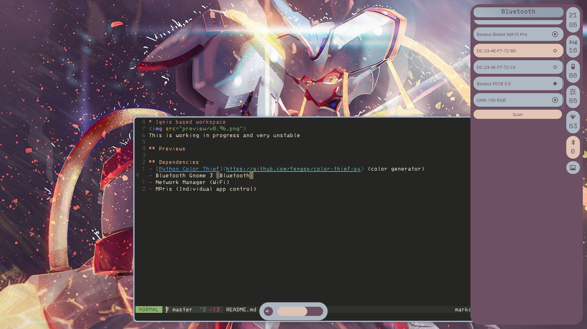
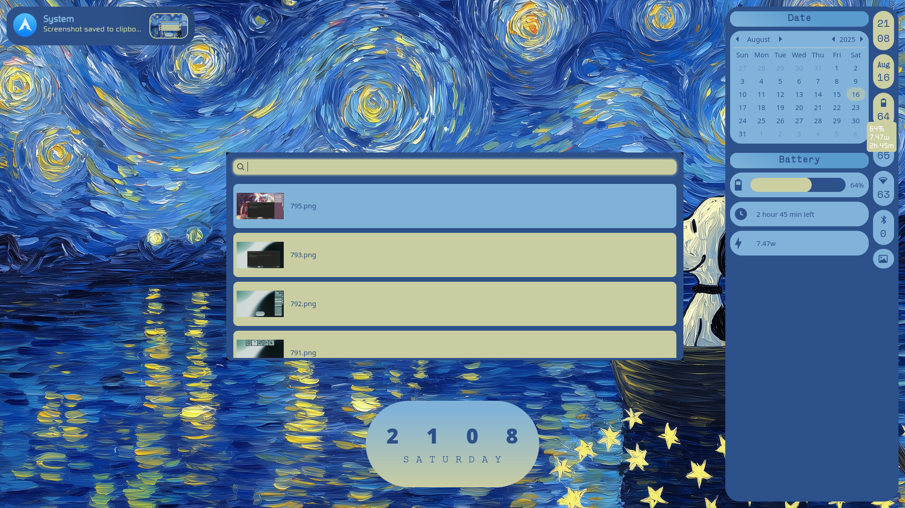

# Ignis based workspace

## Previews

#### credits
[Unsplash: magicpattern](https://unsplash.com/photos/a-blurry-photo-of-a-clock-on-a-wall-87PP9Zd7MNo)
[WC: DreamMaoMao MangoWC](https://github.com/DreamMaoMao/mangowc)

## Dependencies
- [Python Color Thief](https://github.com/fengsp/color-thief-py) (color generator)
- Bluetooth Gnome 3 (Bluetooth)
- Network Manager (WiFi)
- MPris (Individual app control)

## V2 Goals
### Mango intergration
- [x] Workspace number
- [ ] Switch layout
- [ ] Focused window

### Notification customization
- [ ] Cooldown
- [ ] Do not disturb
- [ ] Live notification

### Settings window
- [ ] Wallpaper setting
- [ ] Theme setting
- [ ] About PC

### Better theme generation
- [ ] Ensure distinct color

### Battery customization (tlp)
- [ ] Battery profile
- [ ] Battery threshold
