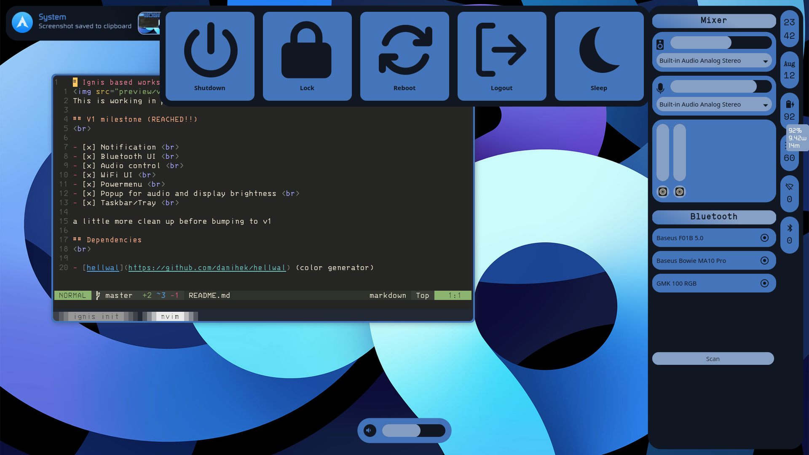

# Ignis based workspace

This is working in progress and very unstable

## V1 milestone (REACHED!!)
 

- [x] Notification  
- [x] Bluetooth UI  
- [x] Audio control  
- [x] WiFi UI  
- [x] Powermenu  
- [x] Popup for audio and display brightness  
- [x] Taskbar/Tray  

a little more clean up before bumping to v1

## Dependencies
 

- [hellwal](https://github.com/danihek/hellwal) (color generator)
- Bluetooth Gnome 3 (Bluetooth)
- Network Manager (WiFi)
- MPris (Individual app control)
