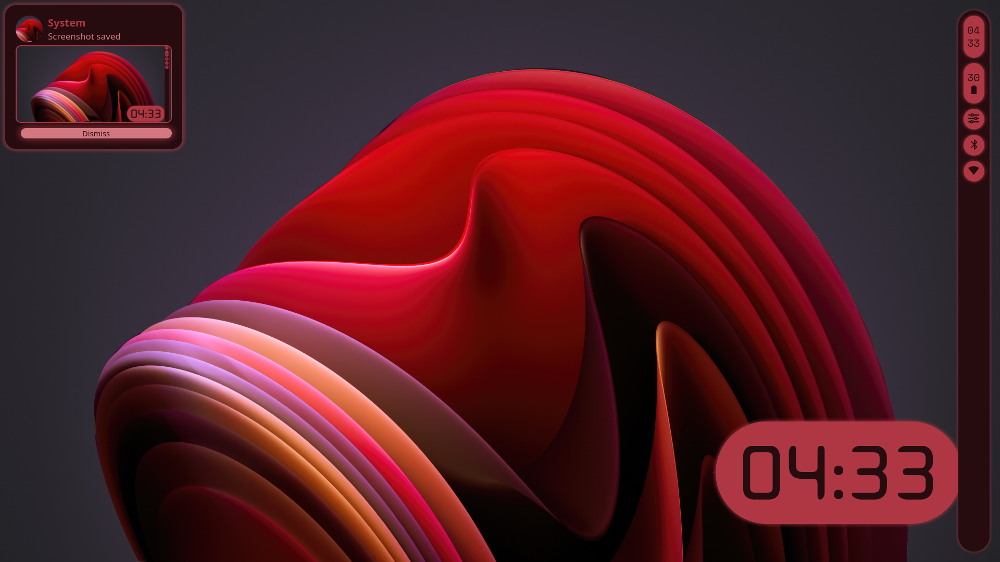

# Ignis based workspace

This is still in work at progress
 
Using screen 1920x1080
 

## Features
 
- [ x ] Notification
 
- [ x ] Taskbar/Tray
 
- [ x ] Bluetooth UI
 
- [ x ] Individual apps audio control
 
- [ x ] Popup for audio and display brightness
 
- [ ] WiFi UI
 
- [ ] VPN UI
 
- [ ] Powermenu
